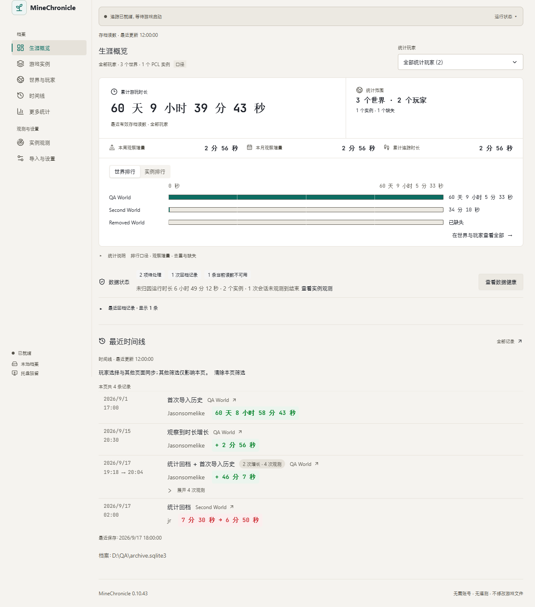
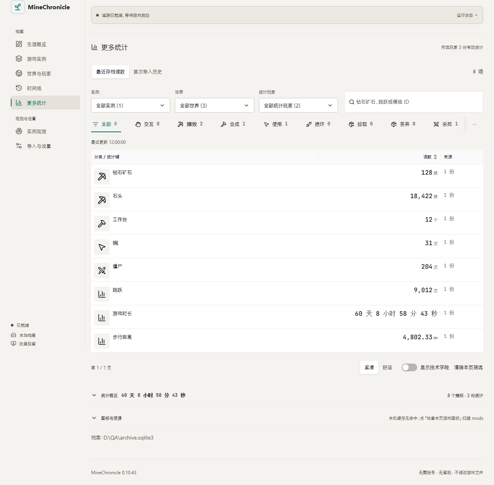
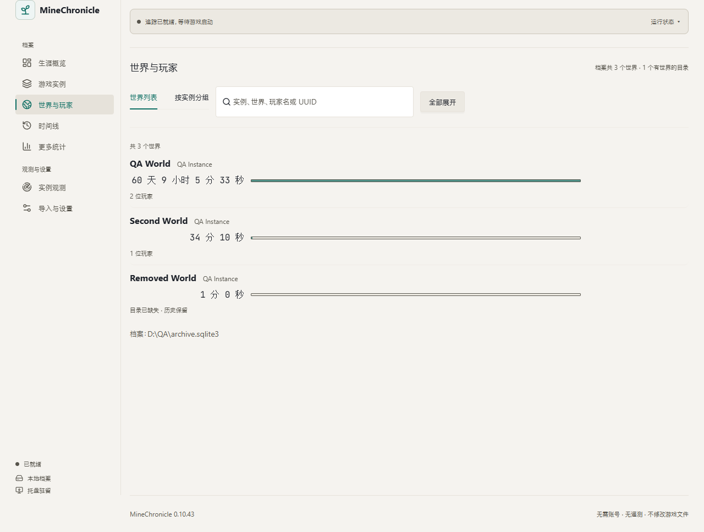

# MineChronicle

[](https://github.com/Jasonsomelike/MineChronicle/actions/workflows/verify.yml)

面向 Minecraft Java Edition 多实例玩家的**本地生涯统计桌面软件**。导入你的游戏根目录（含 PCL2 启动器实例）后，MineChronicle 汇总多个启动器、多个实例、多个玩家目录下的存档读数，给出生涯概览、时间线、世界排行与更多统计——全部数据留在本机，不上传任何服务器。

| 生涯概览                                    | 更多统计                                     | 世界库                                 |
| ------------------------------------------- | -------------------------------------------- | -------------------------------------- |
|  |  |  |

## 功能一览

- **导入与扫描**：手动添加游戏根目录，或自动发现 PCL2 登记的实例；兼容 1.12 至最新版本的新旧两种 stats 布局，损坏存档降级显示而不阻断扫描。
- **生涯概览**：总时长、最近有效读数、世界与实例排行；「自己」快捷项跨页面共享，可组合多个玩家。
- **时间线**：按时间锚点回顾游玩事件，区分首次导入、追踪增量与回档，合并短事件、可按世界/玩家/日期筛选。
- **更多统计**：按分类浏览统计键，配 3.5 万余条模组与游戏内容的中文译名，支持中文搜索；区分最近读数与首次历史。
- **运行实例观测**：游戏运行中每 3 秒识别实例，退出后自动补读最终状态；不弹命令行窗口、不记录登录令牌。
- **数据健康与备份**：健康检查、手动备份与恢复预览，档案可整体迁移到其他磁盘。
- **深浅色主题**、620px–2048px 宽度自适应、等宽字体读数，跟随系统减弱动态效果。

## 下载安装

从 [Releases](https://github.com/Jasonsomelike/MineChronicle/releases) 下载最新版 `MineChronicle_<版本>_x64-setup.exe`：

- Windows 10/11 x64；按当前用户安装，默认无需管理员权限。
- 已安装 WebView2 的机器可完全离线使用；缺失时安装器会获取微软运行库。
- 安装包未作数字签名，SmartScreen 可能提示未知发行者——从本仓库 Releases 下载即为原始构建。

## 快速上手

1. 启动后进入「导入与设置 → 游戏目录」，添加你的 `.minecraft`（或 PCL 实例集合）目录并扫描。
2. 在「导入与设置 → 自己」填写玩家名称或 UUID（支持带或不带连字符），概览、时间线与更多统计会提供「自己」快捷项；同名多账号会一起选中，UUID 则精确定位。
3. 开始游戏后实例会被自动观测；概览与时间线随扫描与追踪持续更新。PCL 用户可在「PCL 自动联动」开启配置同步。

### 示例数据库

想先看看有数据时的界面，可以使用仓库 `sample/minechronicle-sample.sqlite3`——由 `src-tauri/examples/sample_db.rs` 用与正式扫描完全相同的管线生成，玩家 Steve / Alex 与三个世界均为虚构数据：

1. 新建一个空目录，例如 `D:\MineChronicleDemo`；
2. 把 `minechronicle-sample.sqlite3` 复制进去并**改名为 `minechronicle.sqlite3`**；
3. 设置环境变量 `MINECHRONICLE_DATA_DIR=D:\MineChronicleDemo` 后启动应用；体验完删除该目录即可，不影响真实档案。

> 也可以把改名后的示例库放进默认数据目录 `%APPDATA%\dev.minechronicle.desktop`——但请先确认那里没有你的真实档案，示例库会顶替它。

数据目录默认由系统管理（Windows 为 `%APPDATA%\dev.minechronicle.desktop`）；设置 `MINECHRONICLE_DATA_DIR` 可整体迁到其他位置，首次切换会自动迁移旧数据并在原位置留下目录链接。

schema 变更后重新生成示例库（仓库根目录运行）：

```powershell
cargo run --release --manifest-path src-tauri/Cargo.toml --example sample_db -- sample/minechronicle-sample.sqlite3
```

## 从源码构建

验证环境：Windows x64、Node.js 24、npm 11、Rust 1.97、MSVC 与 WebView2。
系统构建依赖参考 [Tauri 官方前置要求](https://v2.tauri.app/start/prerequisites/)。

```powershell
npm ci
npm run tauri dev      # 开发运行（真实后端）
npm run dev            # 仅前端预览，http://127.0.0.1:1420（后端为 mock，「检查桌面连接」会提示预览模式）
```

构建与打包：

```powershell
$env:CARGO_BUILD_JOBS = '1'
npm run desktop:build      # 开发版 src-tauri/target/debug/minechronicle.exe
npm run desktop:package    # NSIS 安装包，输出到 src-tauri/target/release/bundle/nsis/
```

- 限制 Cargo 并行度可降低 Windows 构建的提交内存峰值，避免资源不足引起的元数据映射或误导性的依赖版本错误；同样适用于安装包构建。
- 更新统计资源后，应先完成图标生成，再重建桌面程序；仅构建前端不会更新已有 exe。
- 开发依赖获取可使用 `npm ci --registry=https://registry.npmmirror.com`。本机 `.cargo/config.toml`（已被 Git 忽略）可配置 crates.io 镜像；源码默认使用 crates.io，运行中的产品不需要包管理镜像或外部网络。
- `lightningcss` 暂锁定为 1.32.0，避免新版本可选二进制缺失；已验证生产构建。
- Rust 测试请使用 `cargo`（默认安装位置 `%USERPROFILE%\.cargo\bin`）。

## 验证

一条命令跑完全部检查（TypeScript、ESLint、Vitest、Prettier、rustfmt、Clippy、Rust 测试），CI 在每次推送时执行同一门禁：

```powershell
npm run verify
```

单项也可单独运行：

```powershell
npm run typecheck
npm run lint
npm test
npm run format:check
npm run rust:fmt      # cargo fmt --check
npm run rust:clippy   # cargo clippy --all-targets --jobs 1 -- -D warnings
npm run rust:test     # cargo test --jobs 4
```

- Rust 测试在 Windows 上用 `cmd /C mklink /J` 创建目录联接来验证扫描器不会跟随链接——系统自带内建命令，无需开发者模式或管理员权限。
- `--jobs 1` 用于 Clippy（避免 Windows 上的提交内存峰值）；Rust 测试用 `--jobs 4`。
- Rust 测试只使用合成 JSON 与仓库内 fixture，不读取真实 Minecraft 数据。
- 仓库自带的 QA 脚本（`scripts/qa-*.mjs`）通过 mock IPC 在浏览器里驱动真实组件，用于界面回归与视觉快照对比。
- 每个版本的边界与验证记录写在 `docs/`（`phase-*.md`、`*-0.10.*.md`、`ui-review-*.md`）。

## 架构

```text
src/                       React 界面（antd 6 + 手写 CSS 令牌体系 + Tailwind preflight）
src-tauri/src/
  domain/                  Instance、GameRoot、World、Player、标准统计
  minecraft/               JSON Parser、路径候选接口
  launcher/                LauncherAdapter 契约和 PCL 元数据适配器
  commands/                前端调用的后端状态命令
  scanner/                 目录身份、有限深度扫描、结果与问题模型
  database/                SQLite 迁移、Repository、持久化读取模型
  tracker/                 notify 文件监控、BLAKE3 快照与正向增量
src-tauri/tests/            合成数据和集成测试
sample/                    示例数据库（合成数据）
```

- `Launcher → Instance → GameRoot` 与 `GameRoot → World` 分离；玩家用 UUID 标识，同 UUID 的冲突来源不相加。
- 纯内存 `StatsParser` 按字段结构选择三代格式，统一为非负 `i64` ticks；统计 IPC 用十进制字符串传递 `i64`，避免 JavaScript `number` 精度损失。
- rusqlite 使用内置 SQLite（版本化迁移、事务导入、首次历史快照不可重复累加）；fastnbt、flate2、walkdir 用于只读扫描；notify 与 BLAKE3 用于本地观察。
- 排行与读数动画由 gsap 驱动；系统减少动态效果设置会关闭界面和图表动画。
- 历史、当前读数与追踪增量分别保存；世界关联只在用户复核后建立。

## 参与协作

欢迎 Issue 与 PR，请用中文描述。上手约定：

- **主干是 `master`**：从最新的 `master` 切出功能分支，PR 回 `master`，CI 全绿后合并。
- **提交信息**：简短一行说明"做了什么"（历史记录是英文祈使句风格，中英均可）。
- **行为变更先补记录**：`docs/` 里按版本与主题留档是这个仓库的习惯，改完行为请同步写清验证范围。
- **界面与设计约定**见 `docs/ui-redesign-brief.md`（「高密度仪表台」定位）；设计令牌在 `src/styles/tokens.css` 与 `src/warmth.css`，antd 主题桥在 `src/lib/antdTokens.ts`，令牌变更需让 `npm test` 守卫与 `scripts/qa-design-check.mjs` 保持绿色。
- **数据库 schema 变更**请同步重新生成示例库并更新 `docs/` 迁移说明。

## 隐私约束

- 档案、设置、备份全部保存在本机数据目录；无遥测、无网络上传，运行不需要外部网络。
- 应用层仅在用户指定目录和 PCL 已保存的文件夹范围内**只读**扫描游戏文件；没有写入游戏文件的命令，不读取账号或认证配置。
- 运行实例识别只解析 Java 进程参数中的 `--gameDir` 与 `--version`，不记录完整命令行或登录令牌；PCL 配置只提取白名单内的版本/隔离字段。
- 数据库默认位于 `%APPDATA%/dev.minechronicle.desktop/minechronicle.sqlite3`，迁移后由同目录的小型 `storage.json` 指向其他磁盘上的档案；指定磁盘不可用时拒绝创建空档案。
- 不联网查询玩家名称；离线读取范围内的 `usercache.json` 与手动别名是名称仅有的来源。

## 许可与素材署名

- 本仓库**代码**以 [MIT](LICENSE) 许可发布。
- `public/stat-icons/` 下的统计图标来自各模组与社区资源，**各自按其原始许可发布**（含 [CFPA CC-BY-NC-SA-4.0](public/resource-licenses/CFPA-CC-BY-NC-SA-4.0.txt)、[GTCEu LGPL-3.0](public/resource-licenses/GTCEu-LGPL-3.0.txt)、[PrismarineJS MIT](public/resource-licenses/PrismarineJS-MIT.txt)、[Mojang bedrock-samples](public/resource-licenses/Mojang-bedrock-samples.txt) 等）。完整来源清单位于 `src-tauri/resources/stat-translations.sources.json` 与[统计资源说明](docs/statistics-resources.md)；游戏与模组名称的权利归相应作者。
- Minecraft 是 Mojang 的商标，本项目与 Mojang、Microsoft 无从属关系。
- 感谢 [Tauri](https://tauri.app/)、[Ant Design](https://ant.design/)、[lucide-react](https://lucide.dev/)、[fastnbt](https://github.com/owengage/fastnbt)、[xmcl-model](https://github.com/xmcl/xmcl) 等开源项目。
